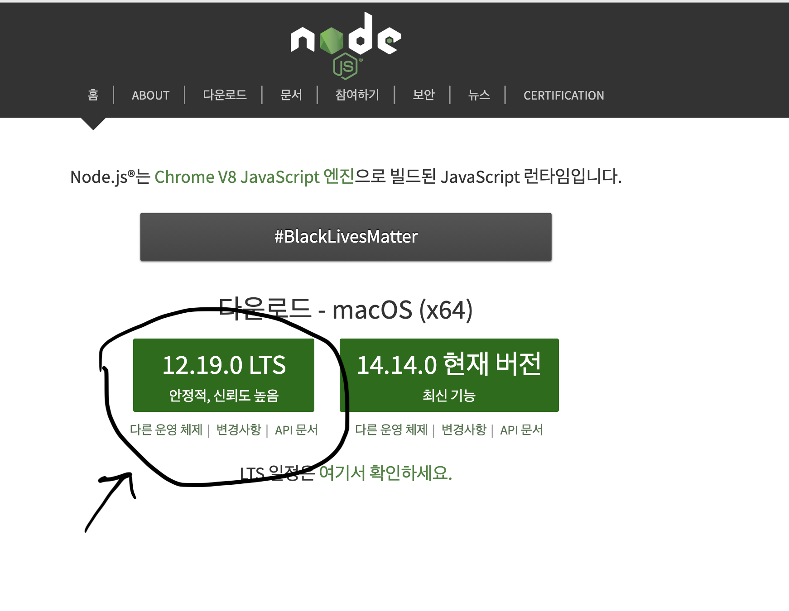

# React Study 자료

강의에 사용한 소스코드를 모아둔 Repository 입니다.

## 샘플코드를 실행하기 전 준비

- [node.js](https://nodejs.org/ko/node.js) 에 방문해서 LTS 버전을 다운로드 한 뒤 설치합니다.

  - node.js의 버전은 계속 올라가므로 스샷과 버전이 다르다고 당황하지 말고 LTS라고 써있는 것을 받으면 됩니다.
- 코드 편집을 위해 [Visual Studio Code](https://code.visualstudio.com/) 혹은 선호하는 편집기를 설치합니다.
- 이후 터미널 혹은 커맨드 프롬프트에서 각 샘플 폴더로 이동 후에 샘플 폴더에 나와있는 방법으로 설치하고 실행해보면 됩니다.
